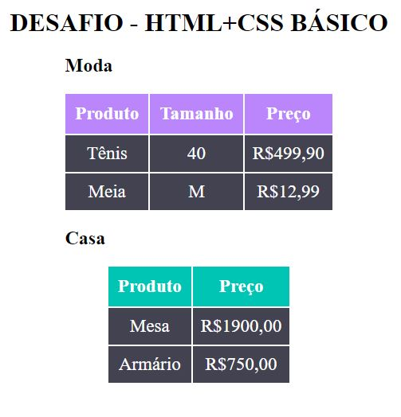

# Projeto Tabela Estilizada (HTML+CSS)
O projeto é um desafio do módulo de HTML & CSS básicos.  ✨

[]

## Tecnologias Utilizadas
- HTML
- CSS

## Como Utilizar
Apenas apresentação da tabela estilizada com categoria de produtos, preço e tamanho.